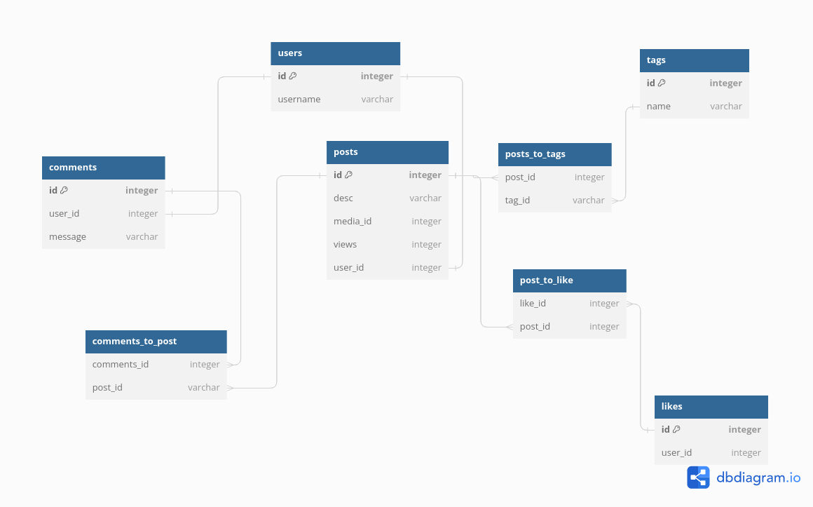
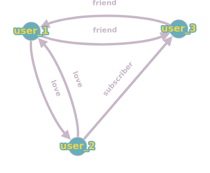

#1. Анкеты людей
###MongoDB
```json

{
  "users": [
	{
	    "user_id": 123,
	    "name": "Alice",
	    "desc": "description by Alice"
	    "photo_id" : 11111 
	    "city" : "Moscow"
	    "interests" : [ "music", "sport" ]
  	}
   ]
}
```

#2. Посты
###Postgres


#3. Личные сообщения и чаты
###MongoDB
```json

{
  "messages_new": [{
    "id": 1,
    "user_id": 123,
    "text": "hello"
    "chat_id" = 33333
  }]

  "messages_all" : [{
    "id": 3,
    "user_id": 123,
    "text": "old message" 
    "chat_id" = 33333
  }]

 

}
```
#4. Отношения
###Neo4j



#5. (фото, аудио, видео)
###Ceph
```
images: {
  id
  name
  data  
}
```

